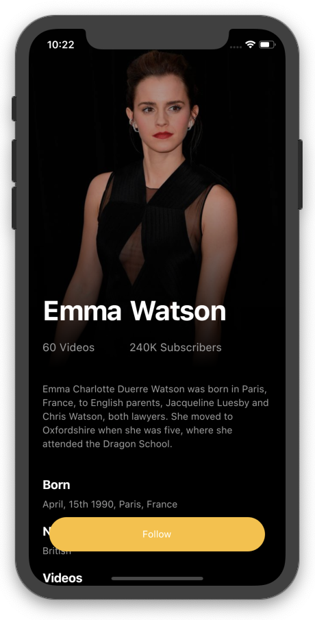
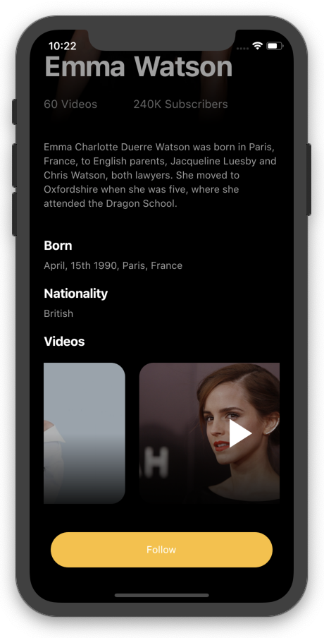

## Flutter Actors Profile Application Design - Day 4

```dart
class Afgprogrammer extends Flutter100DaysOfCode {
  video() {
    return {
      "title": "Flutter Actors Profile Application Design",
      "description": "Let's see how we can use SliverAppBar in Flutter and add some animation.",
      "day": 4,
      "videoLink": "https://youtu.be/3scHvCgi9iY"
    }
  }
}
```

[Youtube Video](https://youtu.be/3scHvCgi9iY)
<br><br>
## Previous Designs
[Checkout my Youtube channel](https://youtube.com/afgprogrammer)

## Development Setup
Clone the repository and run the following commands:
```
flutter pub get
flutter run
```

## ScreenShot



## Links

* [Website](https://afgprogrammer.com)
* [Youtube channel](https://youtube.com/afgprogrammer)
* [Twitter](https://twitter.com/afgprogrammer)
* [Instagram](https://instagram.com/afgprogrammer)
